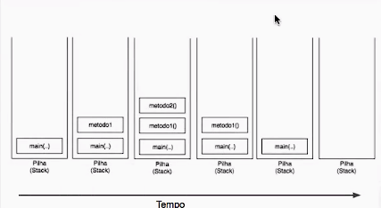

# Funcuncionamento da pilha 

## A ordem de execução de um compilador é representada por essa imagem 

    
    

  

Uma pilha ou stack em inglês é um tipo abstrato de dado e estrutura de dados baseado no princípio
de Last In First Out (LIFO), ou seja "o último que entra é o primeiro que sai" caracterizando um empilhamento de dados.
