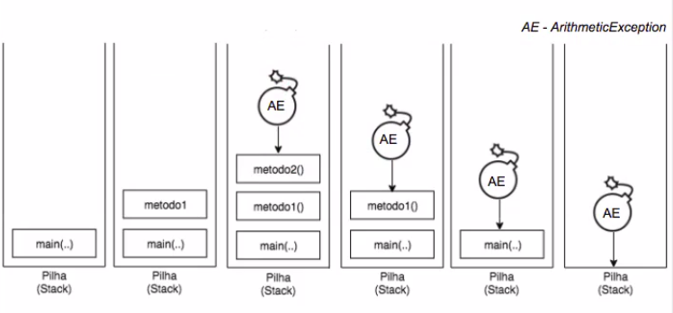

# Tratativa da exceção em formato de pilha 

## Visualização do console

    
    

  

## O fluxo de execução ficara dessa forma 

Podemos imaginar a pilha de execução, como um copo que recebe várias camadas, chamadas de métodos. A ordem de surgimento delas está de acordo com o método que é chamado. Como todo método é chamado a partir da main(), ele sempre estará no fundo do copo, pois é sempre o primeiro.

A main(), por sua vez, chama o metodo1(), que chamará o metodo2(). Como o metodo2() foi o último a ser chamado, ele está no topo do copo. A bomba (exceção) cai no metodo2() e, como ele não tem nenhum bloco de código que possa tratar essa bomba, o metodo2() sai do copo, e cai na função anterior, ou seja, no metodo1().

Por sua vez, o metodo1() também não possui o bloco de código para tratar essa exceção, e por isso, o método sai da pilha, transferindo a exceção para main(); que assim como os anteriores, não possui o tratamento para a exceção, sendo obrigada a sair da pilha de execução, que será jogada no console.

    
    

  

